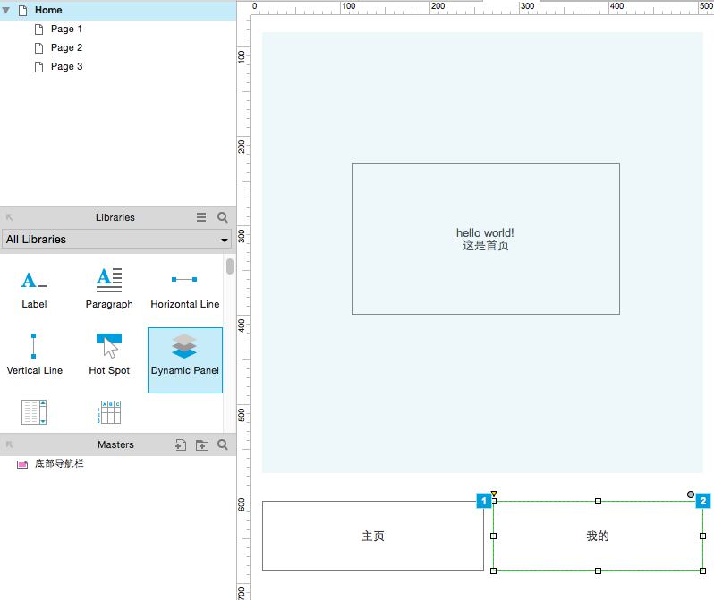
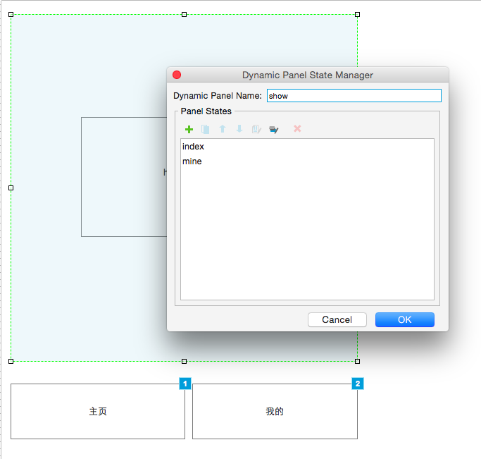
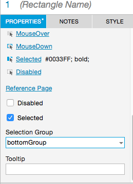
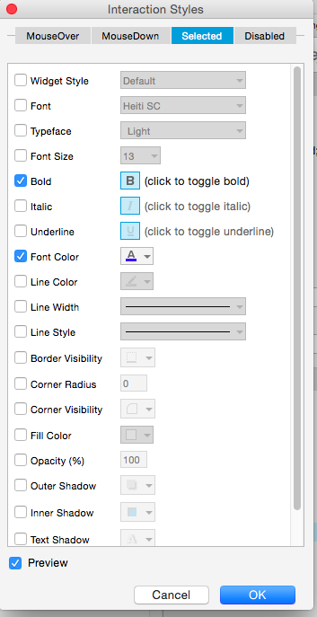
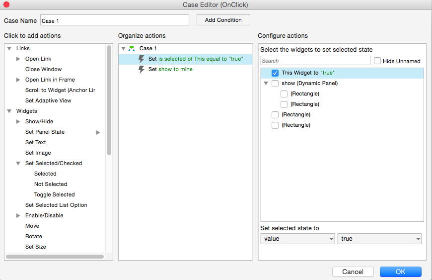
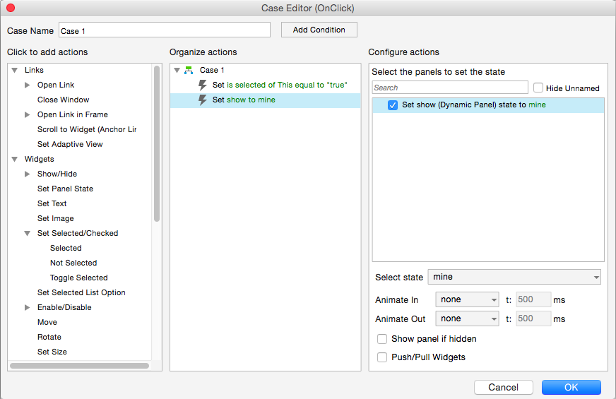

## 用到控件：一个动态面板，两个button控件；


> 大概原理：（主要是动态面板的使用）

```
为两个button控件设置相同的selected显示样式（逐个添加），同时设置相同的selection group 名字；
点击时，赋予被点击控件selected属性，控件会显示其相应样式；
点击两个不同的button，显示其对应的动态子面板；
```

将动态面板拖至合适处，双击显示下面对话框：



添加子panel（实例中：index,mine）



制作底部menu

拖拽两个button控件设置相同的宽高属性，设置为一组控件.



为每一个button设置Selected style.




Add Cases,设置selected对应的子面板：





