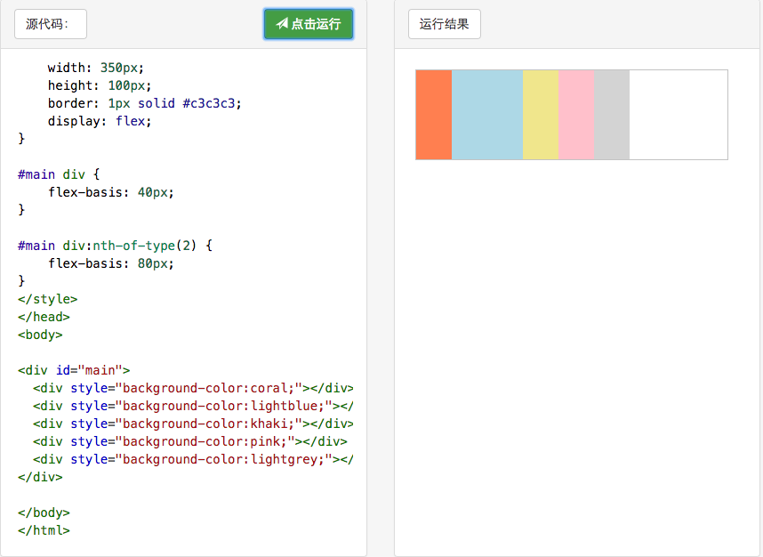

## CSS Id和class选择器

> `id选择器` HTML元素以id属性来设置id选择器,CSS 中 id 选择器以 "#" 来定义。
以下的样式规则应用于元素属性 id="para1":


> `class 选择器` 用于描述一组元素的样式，class 选择器有别于id选择器，class可以在多个元素中使用。
class 选择器在HTML中以class属性表示, 在 CSS 中，类选择器以一个点"."号显示：
在以下的例子中，所有拥有 center 类的 HTML 元素均为居中。


> 指定某标签下选择器样式 


## CSS flex样式
> 任何一个容器都可以指定为 Flex 布局。

``` 
.box{
display: flex;
}
```


> 行内元素也可以使用 Flex 布局

``` 
.box{
display: inline-flex;
}
```

> Webkit 内核的浏览器，必须加上-webkit前缀。

```
.box{
display: -webkit-flex;
display: flex;
}
```
注意，设为 Flex 布局以后，子元素的float、clear和vertical-align属性将失效。

## flex-direction属性

> `flex-direction` 属性决定主轴的方向（即项目的排列方向）。

- row（默认值）：主轴为水平方向，起点在左端。
- row-reverse：主轴为水平方向，起点在右端。
- column：主轴为垂直方向，起点在上沿。
- column-reverse：主轴为垂直方向，起点在下沿。


## flex属性
> `flex 属性`用于设置或检索弹性盒模型对象的子元素如何分配空间。


> direction设置为column之后flex属性看起来失效了!原因不明!

##flex-wrap属性
默认情况下，项目都排在一条线（又称"轴线"）上。flex-wrap属性定义，如果一条轴线排不下，如何换行。


nowrap（默认）：不换行。


##flex-basis
> 该属性来设置该元素的宽度。当然，width也可以用来设置元素宽度。如果元素上同时设置了width和flex-basis,那么flex-basis会覆盖width的值。



`CSS3 :nth-of-type() 选择器` #main div:nth-of-type(2) 表示父标签下的第二个div元素
