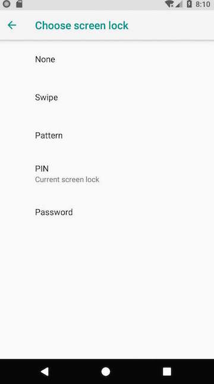

## 设置锁屏方式的入口


锁屏的入口 ***ChooseLockGeneric.java***, 锁屏的方式定义在该文件, 有三种模式, ***Pattern***(对应的是ChooseLockPattern.java), ***Password和Pin***(对应的是ChooseLockPassword.java)

```java
private static final String KEY_UNLOCK_SET_OFF = "unlock_set_off";
private static final String KEY_UNLOCK_SET_NONE = "unlock_set_none";
private static final String KEY_UNLOCK_SET_PIN = "unlock_set_pin";
private static final String KEY_UNLOCK_SET_PASSWORD = "unlock_set_password";
private static final String KEY_UNLOCK_SET_PATTERN = "unlock_set_pattern";
private static final String KEY_UNLOCK_SET_MANAGED = "unlock_set_managed";
```



Confirm your passward对应的类是ConfirmLockPassword.java
Pattern Try again对应的类是ConfirmLockPattern.java
在该文件中可以看到保存锁屏密码的工具类***LockPathernUtils***.java (/frameworks/base/core/java/com/android/internal/widget/LockPatternUtils.java).该类定义了锁屏密码的格式等等.
除了setting入口外, oobe在选择设置fingerprint后也同样能进入该设置页面.
另附keyguardsetting中会出现的几个页面及对应的java文件.


```java
public static final String LOCK_SCREEN_SHOW_NOTIFICATIONS =
"lock_screen_show_notifications";
public static final String LOCK_SCREEN_ALLOW_PRIVATE_NOTIFICATIONS =
"lock_screen_allow_private_notifications";
```

似乎有点没搞清, 图片上明明有3个radiobutton, 为什么code中只枚举了两个