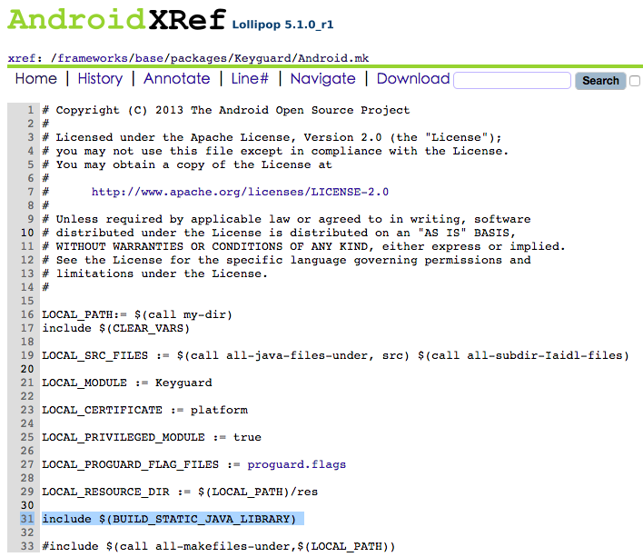
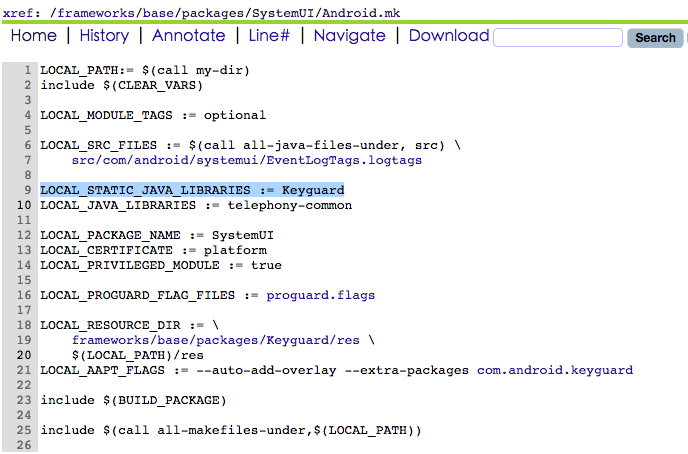
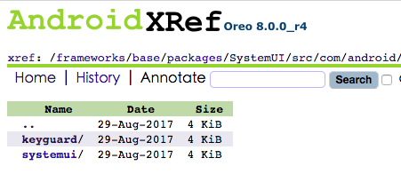
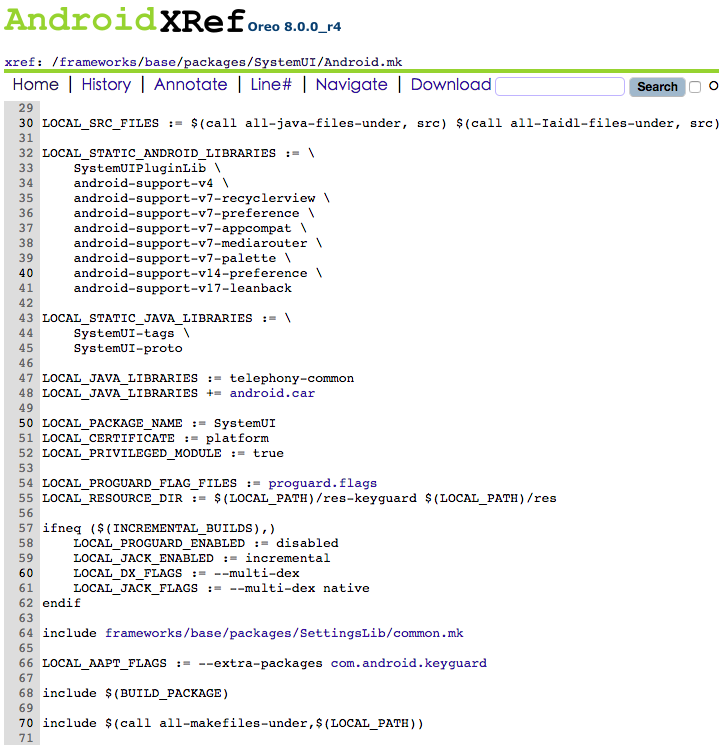

## Android4.4->Android5.1变化最大的一版

   在android4.4版本之前Keyguard是个独立的apk. android5.1之后将Kayguard跟SystemUI合并, 并作为SystemUI的lib.Keyguard的代码路径： \frameworks\base\packages\Keyguard

从Android.mk文件的描述的 include $(BUILD_STATIC_JAVA_LIBRARY)，我们知道，Keyguard并没有被编译成一个APK文件，而是被编译成了一个Java静态库。既然Keyguard被编译成静态库，那这个静态库在哪里被使用呢？  
可以看到，Keyguard的AndroidManifest.xml有两个地方比较特殊，如下：
```
android:sharedUserId="android.uid.systemui"
android:process="com.android.systemui"  
```
这两句是什么意思呢？分别是：
Keyguard使用了共享的用户ID是android.uid.systemui。
Keyguard运行在com.android.systemui进程中，而不是运行在自己的运程中。
通过这两行的定义，都提到了SystemUI，那我们就到SystemUI中看看有没有关于Keyguard的信息呢？我们还是先看看SystemUI工程目录下的Android.mk文件吧。
SystemUI的Android.mk

SystemUI的AndroidMenifest.xml定义了很多权限、Activity、Service、Receiver相关的，在此省略掉了，我们只关心sharedUserId和process是怎样的。SystemUI的sharedUserId和process分别是android.uid.systemui、com.android.systemui，与Keyguard中定义的是一样的，而SystemUI的包名又是：com.android.systemui，从这也就说明了，SystemUI运行在自己的进程中，Keyguard也一起运行在SystemUI当前的运行进程中。
>总结在5.1版本中
1.Keyguard被编译Java静态库。  
2.Keyguard编译成的Java静态库在SystemUI中引入，做为SystemUI的一部分。

 
## Android 8.0 keyguard
在android8.0版本, keyguard又有了新的变化, keyguard的code挪到了systemui路径下, keyguard也不再作为独立的lib被systemui调用.

Keyguard的AndroidManifest.xml


