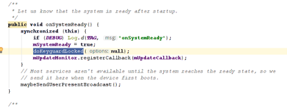
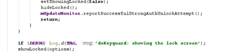
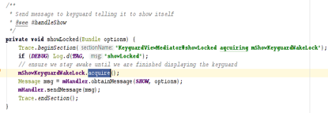
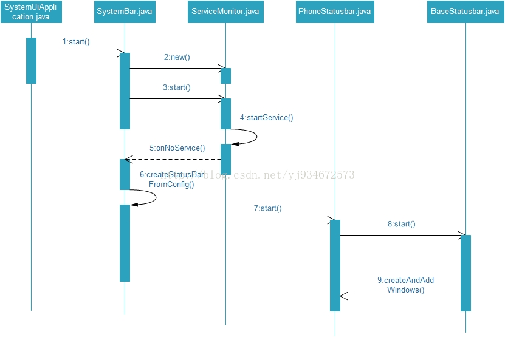
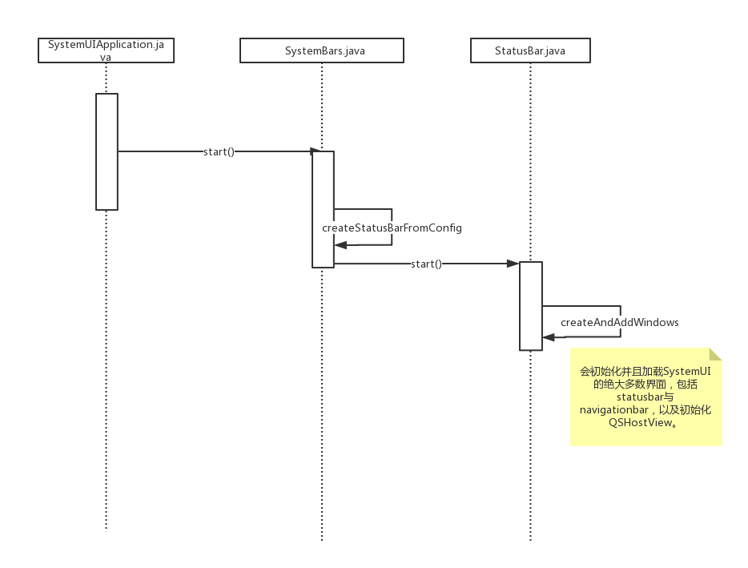
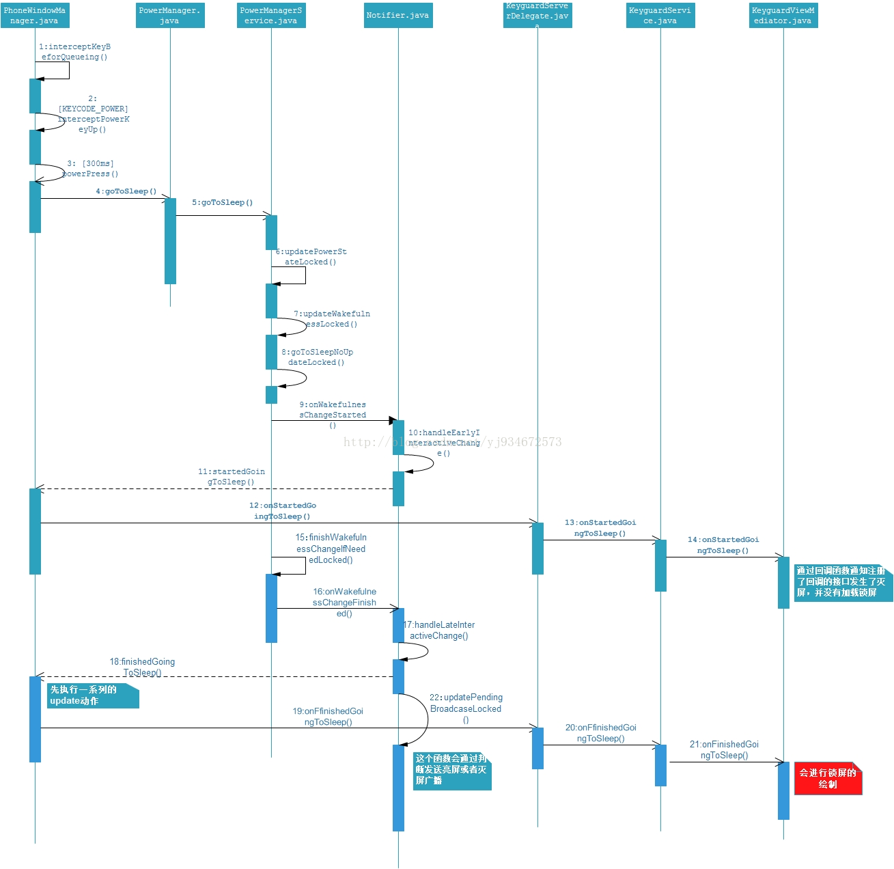

## show keyguard流程
show keyguard有两个触发点，一个是systemReady,意思是系统启动完成以后show keyguard。另一个是screenOff，表示灭屏，手机要灭屏进入休眠状态有两个原因：手动按Power键灭屏（WindowManagerPolicy.OFF_BECAUSE_OF_USER）和 系统自动灭屏（WindowManagerPolicy.OFF_BECAUSE_OF_TIMEOUT）。
### systemReady加锁
在完成系统启动以后，WindowManagerServices成功拉起SystemUI以后，SystemUI也能正常拉起KeyguardViewMediator，执行到onSystemReady中，并通过该方法将Lock show出。

而showLocked()方法中通过发消息的方式将Keyguardshow出来。并在此时acquire亮屏锁，该锁为申请CPU调度时，保证单一性。

在处理show消息的case中，开始执行锁屏的展示动作，包含动画等操作，同样会执行SystemUI对Statubar的变化，Window type的变更。同时开始使用userActivity()来执行即时亮屏等操作。
### sreenOff加锁

## SystemUI的启动

在android8.0版本中,去掉了ServiceMonitor,在systemBars.start()中直接掉起createStatusBarFromConfig();去new StatusBar.java, 这里和7.0不一样的是去掉了BaseStatusBar.
## POWER键灭屏时Keyguard的加载
