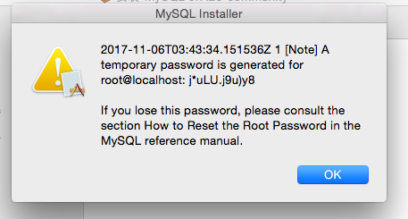
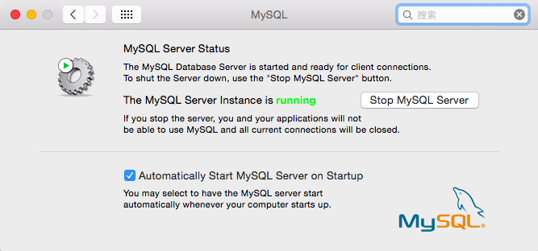

## mac安装mysql

>使用安装包安装mysql, 记得保存最后弹出框中的密码（它是你mysql root账号的密码）



> 安装成功后, 进入系统偏好设置



> 添加环境变量

```
vim .bash_profile
export PATH=${PATH}:/usr/local/mysql/bin
source .bash_profile
```
>修改密码

```
mysql -u root
UPDATE mysql.user SET authentication_string=PASSWORD('*****') WHERE User='root';
FLUSH PRIVILEGES;
\q
```
>登陆到MySQL

```
(mysql -u root -p)
```
mysql -h 主机名 -u 用户名 -p
-h : 该命令用于指定客户端所要登录的MySQL主机名, 登录当前机器该参数可以省略;
-u : 所要登录的用户名;
-p : 告诉服务器将会使用一个密码来登录, 如果所要登录的用户名密码为空, 可以忽略此选项。

详细的解释如下：

前面我们在-h后面填写了localhost，表示的是要登陆到当前主机的MySQL数据库，在这种情况下，-h参数以及localhost完全可以省略，也就是说，使用下面的命令也是可以登陆到本机的MySQL数据库的：

mysql -u root -p

当然，如果你真的要连接到远程主机的MySQL数据库的话，只需要在加上-h参数，再加上远程主机的主机名或者IP地址就可以了，类似如下：

mysql -h 202.116.96.96 -u root -p

对于-p参数，其实我们也可以在p后面直接加上MySQL数据库的密码，也就是说，上面的操作也等价于下面：

mysql -u root -p123456

这里，我的密码是123456，这样之后，按回车键，就可以直接登陆到MySQL数据库中去了。