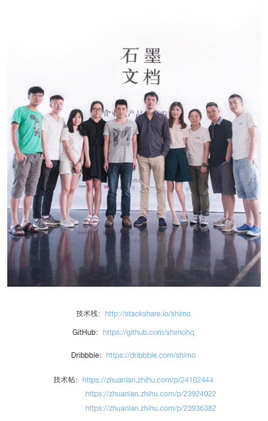
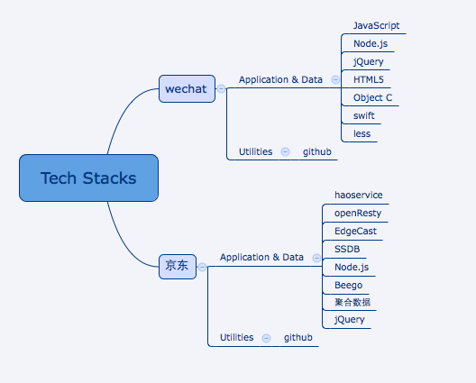

## 看看顶级互联网公司都使用了哪些技术和工具

> 被安利了一个业内比较流行的文档编辑工具---石墨文档,吸引我的并不是他们的卖点协同工作功能.而是他们赋在公司简介最后的技术栈分享. 很不错的样子~

>对于一个开发者而言,我们最想知道的就是世界顶尖公司都都在使用哪些技术栈做开发.
Stackshare: share the stack
https://stackshare.io

一大堆陌生的词来袭~~~

> 随后发现还有个国内山寨版
https://sdk.cn/companies

