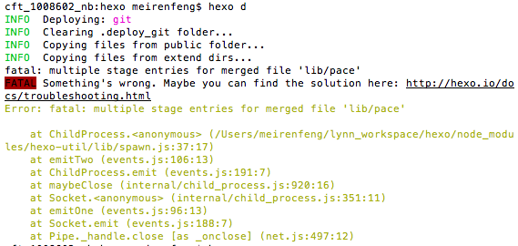
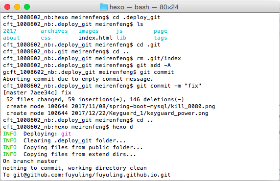

提交代码到gitHub 的时候经常会遇到“fatal:multiple stage entries for merged file” 提示，git status或者git add. 都无济于事。正确的处理姿势如下.
```
rm .git/index  
git add -A    
git commit
```
同理, 通过 **hexo d** 提交到github, 遇到同样的错误, 需要了解hexo是通过什么方式将resource提交到github的.

从上图的错误提示可以知道, hexo d将仓库建在.deploy_git路径下, 该目录下的resource和/hexo/public完全一致

cd 到该目录下, 和普通处理git的方式一样


收工!

