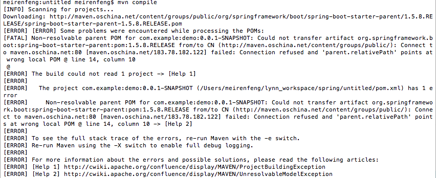
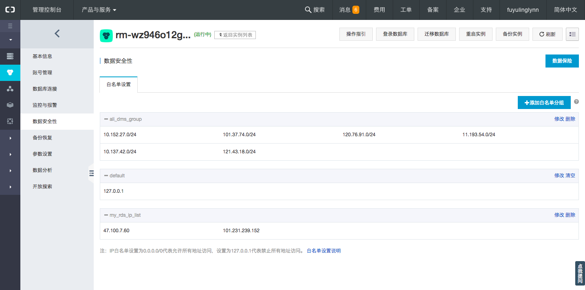

## Spring boot自述

> 来自官方《Spring Boot Reference Guide》
Spring Boot makes it easy to create stand-alone, production-grade Spring based Applications that you can "just run". We take an opinionated view of the Spring platform and third-party libraries so you can get started with minimum fuss. Most Spring Boot applications need very little Spring configuration.

`Features`
- Create stand-alone Spring applications
- Embed Tomcat, Jetty or Undertow directly (no need to deploy WAR files)
- Provide opinionated 'starter' POMs to simplify your Maven configuration
- Automatically configure Spring whenever possible
- Provide production-ready features such as metrics, health checks and externalized configuration
- Absolutely no code generation and no requirement for XML configuration

Spring Boot(英文中是“引导”的意思)，是用来简化Spring应用的搭建到开发的过程。应用开箱即用，只要通过 “just run”（可能是 java -jar 或 tomcat 或 maven插件run 或 shell脚本），就可以启动项目。二者，Spring Boot 只要很少的Spring配置文件（例如那些xml，property）。

因为“习惯优先于配置”的原则，使得Spring Boot在快速开发应用和微服务架构实践中得到广泛应用。

## maven + spring boot + IntelliJ IDEA搭建web项目
启动intellij IDEA后, 按照默认步骤create new project, pom.xml报错,命令行输入mvn compile报错如下.

遇到oschina镜像连接不上

修改maven的setting,添加如下

```xml
<mirror>
<id>alimaven</id>
<name>aliyun maven</name>
<url>http://maven.aliyun.com/nexus/content/groups/public/</url>
<mirrorOf>central</mirrorOf>
</mirror>
<mirror>
<id>CN</id>
<name>OSChina Central</name>
<url>http://maven.oschina.net/content/groups/public/</url>
<mirrorOf>central</mirrorOf>
</mirror>
</mirrors>
``` 

## 简单的小demo
Application很简单，一个main函数作为主入口。SpringApplication引导应用，并将Application本身作为参数传递给run方法。具体run方法会启动嵌入式的Tomcat并初始化Spring环境及其各Spring组件。
```java
package com.example.demomysql;

import org.springframework.beans.factory.annotation.Autowired;
import org.springframework.jdbc.core.JdbcTemplate;
import org.springframework.stereotype.Controller;
import org.springframework.web.bind.annotation.RequestMapping;
import org.springframework.web.bind.annotation.RestController;

@RestController
public class HelloController {

/**
* 配置@RequestMapping 拦截 localhost:8080/springmvc/hello 请求
* @return
*/
@RequestMapping("/hello")
public String helloWorld() {
System.out.println("hello world");
return "helloworld";
}
}
``` 

@RestController：提供实现了REST API，可以服务JSON,XML或者其他。这里是以String的形式渲染出结果。
@RequestMapping：提供路由信息，”/“路径的HTTP Request都会被映射到sayHello方法进行处理。

## 使用Jdbc连接MySQL

> navicat premuim
此工具连接数据库，你可以从中看到各种数据库的详细信息。很方便,比命令行简便多了...


在resource文件夹下添加application.properties配置文件并输入数据库参数，如下：
``` 
spring.datasource.url=jdbc:mysql://127.0.0.1:3306/user_info
spring.datasource.username=root
spring.datasource.password=123456
spring.datasource.driver-class-name=com.mysql.jdbc.Driver
spring.datasource.max-idle=10
spring.datasource.max-wait=10000
spring.datasource.min-idle=5
spring.datasource.initial-size=5
``` 


新建usercontroller类测试数据库是否连接


```java
package com.example.demomysql;

import org.springframework.beans.factory.annotation.Autowired;
import org.springframework.jdbc.core.JdbcTemplate;
import org.springframework.web.bind.annotation.RequestMapping;
import org.springframework.web.bind.annotation.RestController;

import java.util.ArrayList;
@RestController
@RequestMapping(value = "user")
public class UserController {
@Autowired
private JdbcTemplate jdbcTemplate;
@RequestMapping(value = "list")
public Object list() {
return jdbcTemplate.queryForList("select * from user");
}
}

``` 


## 部署到阿里云


ecs创建实例时, 默认没有8080端口,需要我们自己添加

远程登录服务器,创建实例时分配的IP
``` 
//ssh 用户名@公网IP, sshkey.pem是之前创建ecs实例时自动生成的文件
ssh root@47.100.7.60  -i dev/sshkey.pem 
``` 


登录成功后, 安装git, maven, jdk8


将本地code, 上传到服务器, 运行spring install, mvn spring-boot:run, 常驻 nohup mvn spring-boot:run


查看SQL是否能正常连接上



当遇到端口被占用


```
kill pid
```
