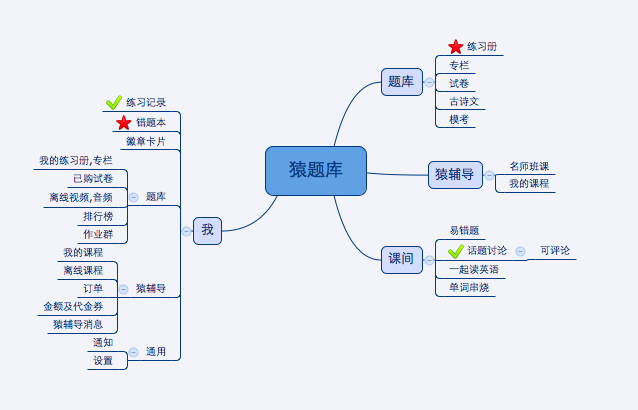
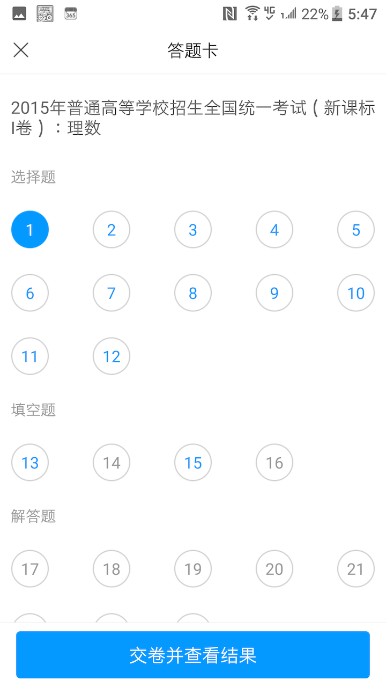
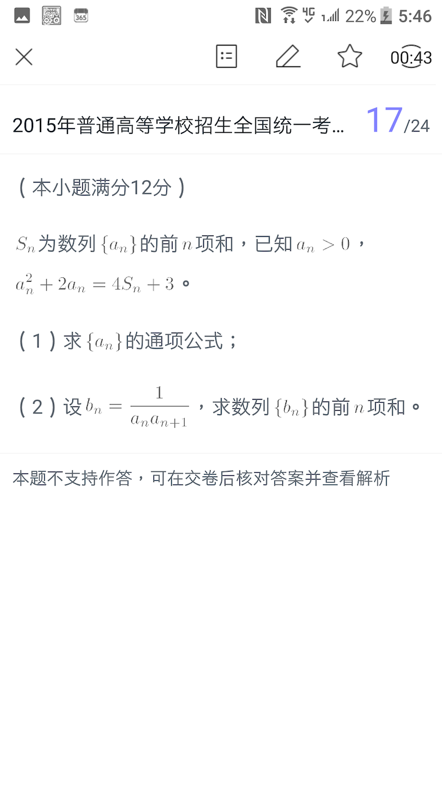
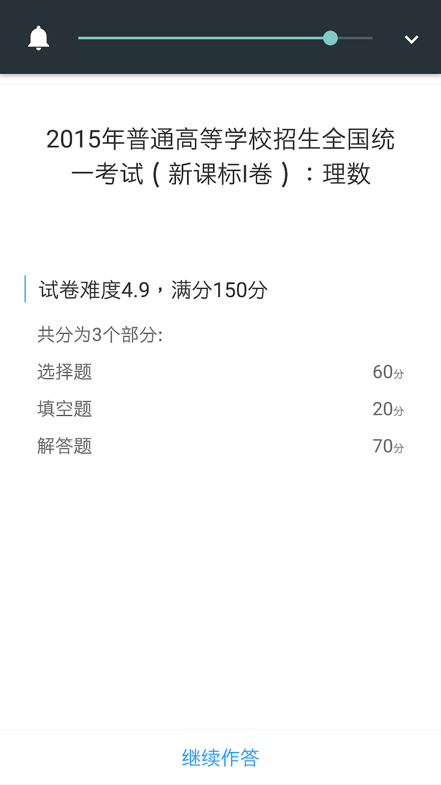
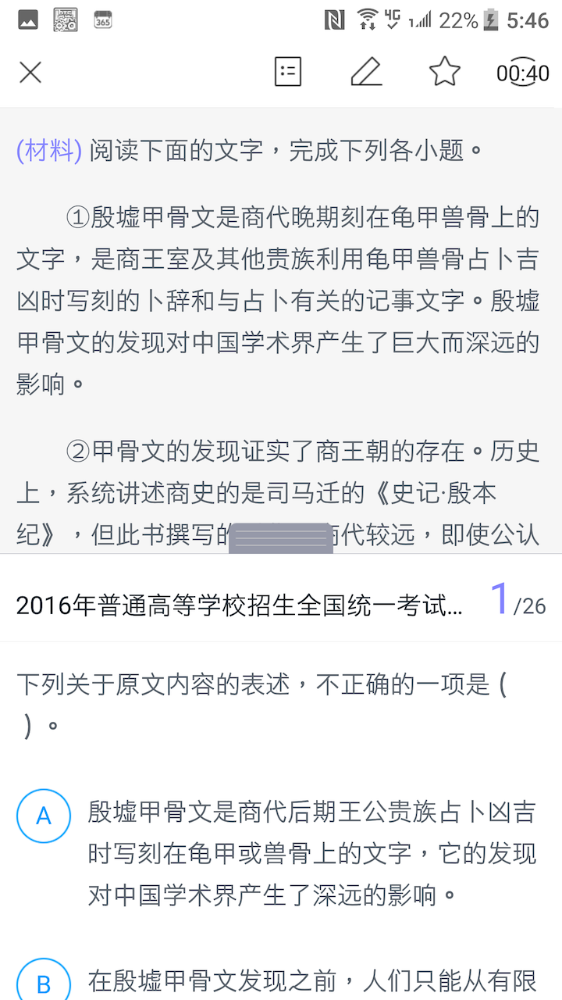
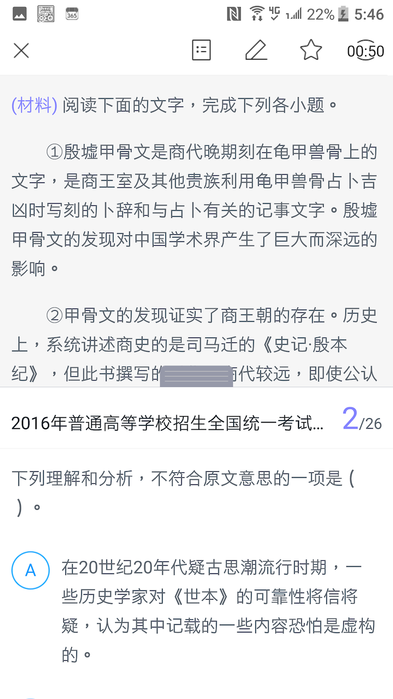

> 一、产品介绍: 猿题库

> 二、产品slogan: 无论身在何处，都有机会逆袭当学霸！

> 三、产品结构图

> 四、功能体验分析及优化

   这是一款非常成熟的考试APP, 体验很赞, 特别是模拟考试答题方式,覆盖考试题集很广,包含历年高考真题、名校期末试题、真题及。

1、核心功能（1~2个）

    模拟考试, 错题集.
   
    

分析：

（1）对功能的理解
  
  答题模式,题目和答案分开,可查看答题卡.

（2）满足了什么需求（基本、期望、兴奋）

